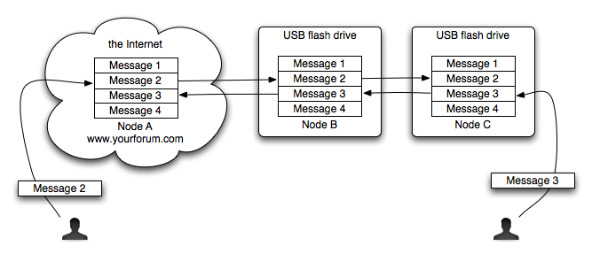

# Sneakernet Forum -- Internet forum software for people without Internet access.

Sneakernet Forum is free and open-source software for creating a distributed web forum.  Multiple different independent
web server nodes coordinate to create a single, coherent discussion forum.  The web server nodes can operate in
disconnected mode, and they can relay messages for other nodes.  This enables forum participation for users without
Internet connections, using web server nodes that also do not have Internet connections.  Sneakernet Forum allows
messages to be relayed using a "[sneakernet](http://en.wikipedia.org/wiki/Sneakernet)", including USB Flash drives or
any other form of mobile media.

An ordinary Internet forum is a web application that hosts discussions.  People can participate in the conversations by
connecting to the web site directly.  Some discussion systems, such as [Usenet](http://en.wikipedia.org/wiki/Usenet)
enable conversations using [distributed](http://en.wikipedia.org/wiki/Distributed_computing) systems, consisting of
multiple different independent sites.  A conversation on Usenet may consist of messages written by users of different
Usenet nodes, which may not be directly connected to one another.

Sneakernet Forum uses a similar design to create coherent discussions using multiple different independent nodes.
But unlike Usenet, Sneakernet Forum nodes are designed to be portable, possibly carried on USB Flash drives and other
mobile media.  Sneakernet Forum nodes are also capable of connecting to alternate Internet nodes when the primary
nodes are blocked by Internet filters or are otherwise unreachable.  Sneakernet Forum, unlike Usenet, is designed
for users who have no Internet access, as opposed to intermittent Internet access.  It allows a chain of intermediate
relay nodes to carry messages back and forth to the Internet.

The Sneakernet Forum software maintains copies of the conversations on your forum in multiple different places,
including USB flash drives.  If you post a message to a conversation from any node, then your message will be
copied to all of the other nodes when people sync different nodes to one another.  Even if the node that you can
access never has Internet access, your messages can still reach the Internet through relay nodes.

# Status

Sneakernet Forum is currently experimental, and is not yet ready for widespread deployment.  Please contact
<info@informationwithoutborders.org> if you're interested in helping to beta test Sneakernet Forum by operating
your own distributed sneakernet forum.

# Technical Details

Sneakernet Forum is a project built using [Ruby](http://www.ruby-lang.org/en/), with an included web application built
using [Ruby on Rails](http://rubyonrails.org/).  The project is [hosted by GitHub](https://github.com/endymion/sneakernet).
This web site is hosted by [GitHub Pages](http://pages.github.com/).