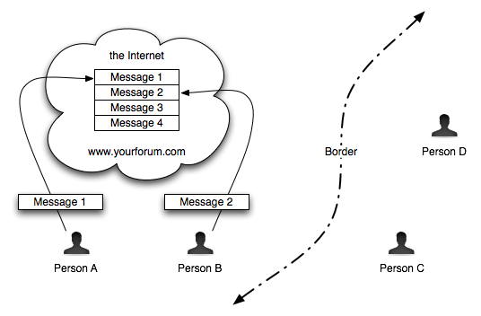
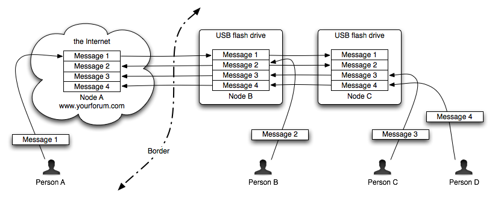

# Sneakernet Forum
## Internet forum software for people without Internet access.

A traditional Internet forum is a web application that hosts discussions.  People can participate in the
conversations by connecting to the web site directly.  In Figure 1, the Internet discussion forum at
www.yourforum.com consists of a collection of messages, and Person A and Person B have both posted messages by
directly connecting to the web site through the Internet.  Person C and Person D, who don't have a way
to connect to the web site using the Internet, cannot participate in the discussion forum.

  
  *Figure 1: Traditional Web Forum*

Sneakernet Forum is free and open-source software for creating a distributed web forum.  Multiple different independent
web server nodes coordinate to create a single, coherent discussion forum.  The web server nodes can operate in
disconnected mode, and they can relay messages for other nodes.  This enables forum participation for users without
Internet connections, using web server nodes that also do not have Internet connections.  Sneakernet Forum allows
messages to be relayed using a "[sneakernet](http://en.wikipedia.org/wiki/Sneakernet)", including USB Flash drives or
any other form of mobile media.  In Figure 2, the Internet discussion forum at www.yourforum.com consists of a
collection of messages, which are also copied periodically onto USB flash drives.  When you plug one of those
flash drives into a computer, it becomes a part of the www.yourforum.com discussion forum, even if it can't connect
through the Internet to www.yourforum.com.  Person B carries a usb flash drive that contains copies of most of the
messages in the forum.  Person C and Person D can access the forum using usb flash drives that have been synced
with the main web site, or they can be synced second-hand or third-hand.

  
  *Figure 2: Distributed Relay Forum*

The Sneakernet Forum software maintains copies of the conversations on your forum in multiple different places,
including USB flash drives.  If you post a message to a conversation from any node, then your message will be
copied to all of the other nodes when people sync different nodes to one another.  Even if the node that you can
access never has Internet access, your messages can still reach the Internet through relay nodes.

  
  *Figure 3: Message Relay Overview*

# Status

Sneakernet Forum is currently experimental, and is not yet ready for widespread deployment.  Please contact
<info@informationwithoutborders.org> if you're interested in helping to beta test Sneakernet Forum by operating
your own distributed sneakernet forum.

# Technical Details

Sneakernet Forum is a project built using [Ruby](http://www.ruby-lang.org/en/), with an included web application built
using [Ruby on Rails](http://rubyonrails.org/).  The project is [hosted by GitHub](https://github.com/endymion/sneakernet).
This web site is hosted by [GitHub Pages](http://pages.github.com/).